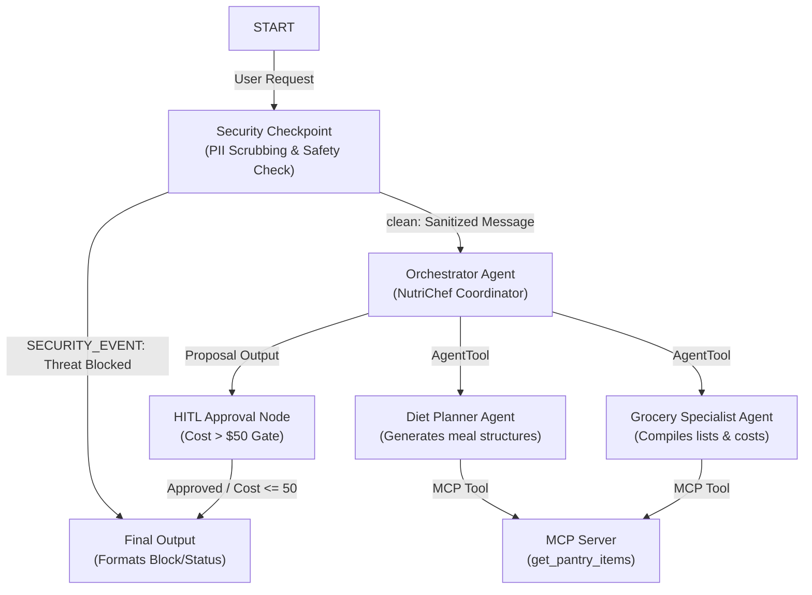

# Submission Write-Up: NutriChef

## Problem Statement
NutriChef addresses the daily struggle of meal planning and grocery shopping. Preparing nutritious meals tailored to personal dietary preferences, food allergies, and household budgets is time-consuming. Additionally, people frequently overbuy groceries, resulting in food waste, or purchase items they already have in stock because they cannot easily check their pantry inventory. NutriChef automates this workflow securely and intelligently.

## Solution Architecture

## Concepts Used

- **ADK Workflow Graph API (ADK 2.0)**: The entire orchestration is built as a graph-based state machine in [agent.py](file:///e:/adk-workspace/nutrichef/app/agent.py#L295-L314). This allows deterministic paths for security rejections, coordinate agent actions, and manage execution pauses.
- **LlmAgent**: Three specialized agents ([agent.py](file:///e:/adk-workspace/nutrichef/app/agent.py#L70-L113)) isolate roles: an `orchestrator` coordinator, a `diet_planner` nutritionist, and a `grocery_specialist` list manager.
- **AgentTool**: The orchestrator integrates `diet_planner` and `grocery_specialist` as tools ([agent.py](file:///e:/adk-workspace/nutrichef/app/agent.py#L110)), enabling dynamic delegation while remaining in control.
- **MCP Server**: Implemented at [mcp_server.py](file:///e:/adk-workspace/nutrichef/app/mcp_server.py) to manage pantry database interactions and recipe catalog queries, wired via `McpToolset` into the LlmAgents.
- **Security Checkpoint**: A node in the workflow ([agent.py](file:///e:/adk-workspace/nutrichef/app/agent.py#L118-L214)) running before LLM execution to scrub PII and filter hazardous injection attacks.
- **Agents CLI**: Project scaffolded with `agents-cli scaffold create` and configured using [config.py](file:///e:/adk-workspace/nutrichef/app/config.py) and `.env`.

## Security Design

- **PII Scrubbing**: Prevents leakage of phone numbers or email addresses into external LLM prompts. This is crucial for privacy in health-related and personal home assistant domains.
- **Prompt Injection Detection**: Blocks command injection attempts (e.g. `bypass`, `ignore instructions`) before they reach LLM reasoning blocks, ensuring deterministic and safe outputs.
- **Domain Safety Rules**: Blocks queries related to toxic substances (`poison`, `bleach`) and extreme unsafe diets (`starvation`), guarding the user against hazardous dietary suggestions.
- **JSON Audit Logs**: Emits structured logs for all security actions, enabling monitoring and auditing for compliance.

## MCP Server Design

The server exposes three stdio-based tools:
1. `get_pantry_items`: Allows the `grocery_specialist` to fetch currently stocked items. This avoids redundant purchases.
2. `add_to_pantry`: Allows updating the inventory.
3. `search_recipes`: Integrates with `diet_planner` to design meal plans utilizing mock database recipes.

## HITL Flow
Human-in-the-loop (HITL) check is implemented at the `hitl_approval` node. When the estimated cost of groceries exceeds a $50 limit, the workflow returns a `RequestInput` object, halting execution and prompting the user for approval. This guarantees that users retain control over budgets before final menu confirmation. Once approved (or if the budget is under $50), a final `Event` carrying the updated state is returned.

## Demo Walkthrough
1. **Case 1 (Pasta plan)**: User submits a request containing their phone number. The number is scrubbed, and a pasta plan under $50 is instantly created and auto-approved.
2. **Case 2 (Steak plan)**: User asks for a lavish feast. The cost is computed at $120. The agent pauses, prompting the user for approval. When the user responds `yes`, the plan is finalized and displayed.
3. **Case 3 (Poison diet)**: User attempts to bypass safety and requests a diet with poison. The security node intercepts it and shuts down the workflow, outputting a security block banner.

## Impact / Value Statement
NutriChef improves the home kitchen management experience. By coordinating specialized agents and integrating with local inventory tools, it lowers food waste, keeps family meal planning within budget limits, and respects user privacy via local-first security checkpoints.
