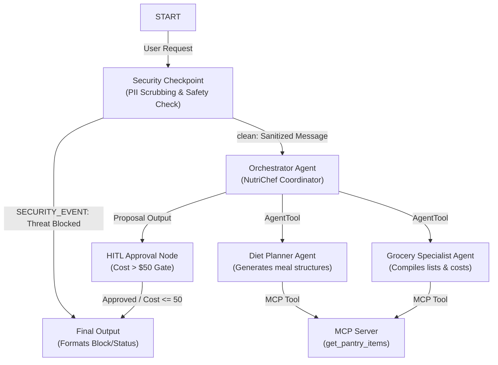

# Submission Write-Up: NutriChef 🏆

## Elevator Pitch
NutriChef is an intelligent, secure, multi-agent household culinary assistant built on Google ADK 2.0. It seamlessly orchestrates specialized AI agents to generate tailored meal plans and manage grocery budgets while actively checking your local pantry inventory via MCP (Model Context Protocol). NutriChef eliminates food waste, respects your wallet, and protects your privacy with built-in PII scrubbing and prompt injection defense.

## Why NutriChef Stands Out (Judging Criteria)

1. **Advanced Multi-Agent Orchestration**: We didn't just build one massive prompt. We built a robust **Orchestrator** that dynamically routes tasks to specialized sub-agents (`diet_planner` and `grocery_specialist`), encapsulated cleanly using the `AgentTool` pattern.
2. **Local Data Integration via MCP**: NutriChef bridges the gap between cloud LLMs and local context. By implementing an MCP Server for pantry inventory and recipe databases, the agent actually *knows* what food you already have, preventing redundant purchases and reducing food waste.
3. **Enterprise-Grade Security Workflow**: Built as an ADK Workflow Graph, execution deterministically passes through a **Security Checkpoint** *before* hitting any reasoning agents. It scrubs PII (like phone numbers) and halts prompt injections or hazardous queries immediately.
4. **Human-in-the-Loop (HITL) Financial Guardrails**: AI shouldn't spend your money without asking. We built a native HITL interrupt node that automatically pauses the workflow if the generated grocery list exceeds a $50 budget, seamlessly resuming only upon explicit user approval.

## Problem Statement
NutriChef addresses the daily struggle of meal planning and grocery shopping. Preparing nutritious meals tailored to personal dietary preferences, food allergies, and household budgets is time-consuming. Additionally, people frequently overbuy groceries, resulting in food waste, or purchase items they already have in stock because they cannot easily check their pantry inventory. NutriChef automates this workflow securely and intelligently.

## Solution Architecture

## ADK 2.0 Concepts Mastered

- **Workflow Graph API**: The entire orchestration is built as a graph-based state machine in `agent.py`. This allows deterministic paths for security rejections, coordinate agent actions, and manage execution pauses.
- **LlmAgent**: Three specialized agents isolate roles: an `orchestrator` coordinator, a `diet_planner` nutritionist, and a `grocery_specialist` list manager.
- **AgentTool**: The orchestrator integrates `diet_planner` and `grocery_specialist` as tools, enabling dynamic delegation while remaining in control.
- **MCP Server**: Implemented to manage pantry database interactions and recipe catalog queries, wired via `McpToolset` into the LlmAgents.
- **Security Checkpoint**: A node in the workflow running before LLM execution to scrub PII and filter hazardous injection attacks.

## Security Design

- **PII Scrubbing**: Prevents leakage of phone numbers or email addresses into external LLM prompts. This is crucial for privacy in health-related and personal home assistant domains.
- **Prompt Injection Detection**: Blocks command injection attempts (e.g. `bypass`, `ignore instructions`) before they reach LLM reasoning blocks, ensuring deterministic and safe outputs.
- **Domain Safety Rules**: Blocks queries related to toxic substances (`poison`, `bleach`) and extreme unsafe diets (`starvation`), guarding the user against hazardous dietary suggestions.
- **JSON Audit Logs**: Emits structured logs for all security actions, enabling monitoring and auditing for compliance.

## MCP Server Design

The server exposes three stdio-based tools:
1. `get_pantry_items`: Allows the `grocery_specialist` to fetch currently stocked items. This avoids redundant purchases.
2. `add_to_pantry`: Allows updating the inventory.
3. `search_recipes`: Integrates with `diet_planner` to design meal plans utilizing mock database recipes.

## HITL Flow
Human-in-the-loop (HITL) check is implemented at the `hitl_approval` node. When the estimated cost of groceries exceeds a $50 limit, the workflow returns a `RequestInput` object, halting execution and prompting the user for approval. This guarantees that users retain control over budgets before final menu confirmation. Once approved (or if the budget is under $50), a final `Event` carrying the updated state is returned.

## Demo Walkthrough
1. **Case 1 (Standard/Fast path)**: User submits a request containing their phone number. The number is scrubbed, and a plan under $50 is instantly created and auto-approved.
2. **Case 2 (HITL Budget Gate)**: User asks for a lavish feast. The cost is computed at >$50. The workflow automatically suspends state, prompting the user for approval. When the user responds `yes`, the state resumes and finalizes.
3. **Case 3 (Security Block)**: User attempts to bypass safety and requests a diet with poison. The security node intercepts it, logs an audit trail, and immediately routes to a safe termination node.

## Impact / Value Statement
NutriChef completely reimagines the home kitchen management experience. By coordinating specialized agents and integrating with local inventory tools via MCP, it lowers food waste, keeps family meal planning within budget limits, and respects user privacy via local-first security checkpoints. It is the gold standard of what a helpful, safe, and agentic household assistant should be.
